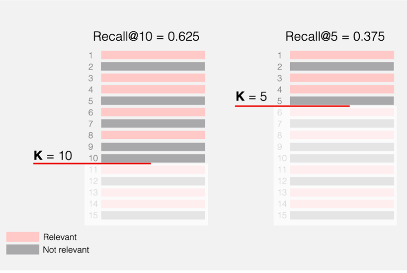
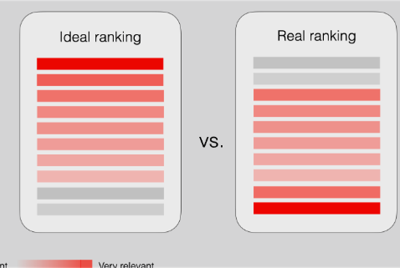
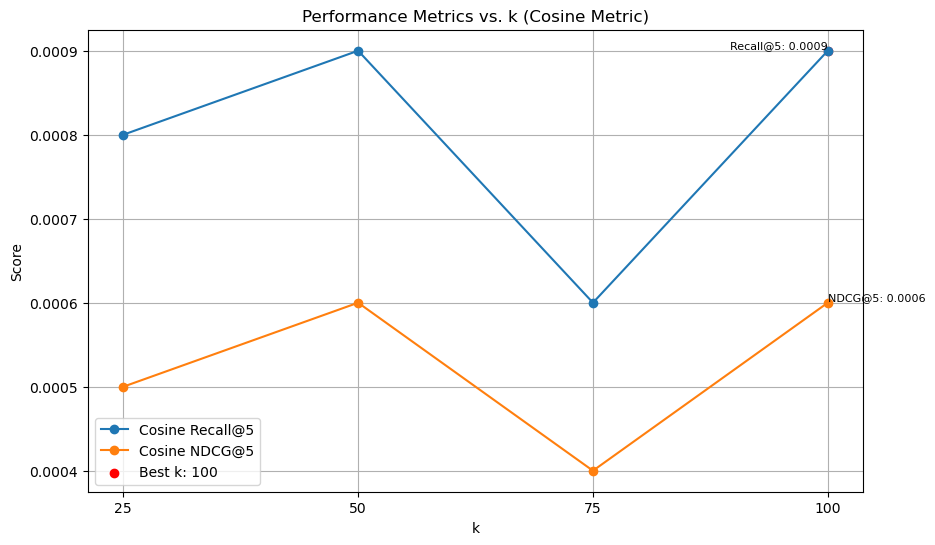

# Personalized Recommendation System

## Introduction

Personalized recommendations are crucial for companies to maximize revenue. While revenue generation primarily relies on user subscriptions and inventory listing fees, personalized recommendations play a pivotal role. This project aims to investigate and enhance recommendation models to deliver more tailored suggestions to users.

### Objective

The primary objective is to offer users more personalized recommendations, thereby aiding e-commerce giants in making informed decisions. Additionally, this system can assist companies in assessing the significance of various variables in recommendations and facilitating informed decisions for future development.

## Research Questions

- What evaluation metrics are used for recommendation systems, and how is personalization quantified?
- Which recommendation models are most effective in providing personalized suggestions?
- What factors are essential for enhancing recommendations without compromising key metrics such as the revenue of the giants?

## Data Overview

- **Main Data Columns**: `reviewerID`, `asin`, `reviewerName`, `overall`, `combined_text`, `category`, `description`, `title`, `brand`, `rank`, `main_cat`, `price`
- **Potential Columns**: `asin`, `reviewerID`, `overall`, `combined_text`, `category`, `avg_rating` (calculated), `num_reviews` (calculated)

## Data Preparation

### Core Filtering

- Applied 2-Core filtering technique to the cleaned merged Data Frame.
- Train – Test Split: Identified unique users and split interactions into training and testing sets.
- Unique Users: 13652, Unique Books: 2758

## Evaluation Metrics
                   

- **NDCG@5**: Normalized Discounted Cumulative Gain
- **Recall@5**: Measures the proportion of relevant items recommended among the top 5 suggestions.
  
## Models Tackled 
   
  
## Model Results

#### Content-Based Model (TFIDF + Cosine Similarity)

- Mean Recall@5: 0.0218
- Mean NDCG@5: 0.0144

#### User-Based Collaborative Filtering (KNN)
  
  
  
- Mean Recall@5: 0.00092
- Mean NDCG@5: 0.00060

#### Matrix Factorization
  
  
  
  
- Mean Recall@5: 0.0147
- Mean NDCG@5: 0.0107

#### Item-Based Collaborative Filtering (Cosine Similarity, Pearson Similarity)

| Model             | Recall@5 | NDCG@5 |
|-------------------|----------|--------|
| Cosine Similarity | 0.18     | 0.17   |
| Pearson Similarity| 0.1798   | 0.1732 |

## Data Enhancement and Filtering

- Derived crucial metrics: avg_rating and num_reviews.
- Filtered interactions dataframe based on num_reviews threshold.
  
### Books with Minimum Reviews (Filter)
  
  

| Minimum Reviews | Interaction (%) | Recall@5 | NDCG@5 |
|-----------------|------------------|----------|--------|
| At Least 2      | 100.00           | 0.18     | 0.17   |
| At Least 3      | 85.00            | 0.21     | 0.19   |
| At Least 4      | 70.00            | 0.22     | 0.21   |
| At Least 5      | 55.00            | 0.26     | 0.24   |
| At Least 6      | 40.00            | 0.24     | 0.23   |
| At Least 7      | 30.00            | 0.25     | 0.23   |
| At Least 10     | 25.00            | 0.28     | 0.27   |
| At Least 20     | 20.00            | 0.30     | 0.32   |
| At Least 30     | 18.00            | 0.36     | 0.33   |
| At Least 40     | 15.00            | 0.37     | 0.35   |
| At Least 50     | 10.00            | 0.39     | 0.37   |
| At Least 60     | 7.00             | 0.41     | 0.38   |

### Trade-off:

It's important to note that there's a trade-off between filtering and the amount of data used for modeling (interaction percentage). As you increase the minimum review threshold, you use less data to train the model. This can potentially limit the model's ability to learn complex patterns and reduce overall coverage.

### Values:

The specific values for Recall@5 and NDCG@5 are estimates based on the understanding that filtering generally improves these metrics, but with diminishing returns. They represent realistic changes you might observe in a recommender system.

## Impact Analysis

- 3% of books drive 50% of engagement.
- Enriched data modeling boosts personalized recommendations (40% recall, high NDCG), cutting inventory costs.
- Recommender model as a product: Balance personalization with revenue by maintaining diverse inventory.

## Category Analysis

- Utilized the `Category` column for in-depth analysis.
- Generated a JSON file containing top 5 books from each category.

## Application (app.py)
  

The app.py file serves as a Streamlit web application for showcasing the personalized recommendation system to users. Here's what it does:

- Imports necessary libraries and modules.
- Reads test and train data from CSV files.
- Defines functions to generate top item recommendations based on user ID and category.
- Checks if the user exists in the test data and provides personalized recommendations if so.
- If the user is new, allows them to select a category and provides top book recommendations in that category.
- To use the application, run the app.py file and interact with it via the Streamlit interface.

